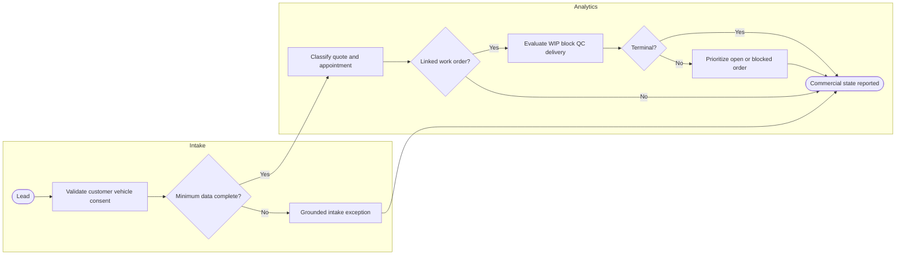

# SOP — Particulares y taller

**Authority:** analytical snapshot only. The map classifies existing records; it does not contact customers or move operational states.

## Procedure

1. Select `customers.segment=particular` leads and resolve customer/optional vehicle references.
2. Grade consent and vehicle coverage. Missing coverage becomes review, not permission to contact.
3. In the V2 synthetic studio, use explicit `journey_links` for the 160 generated cases; this supports attribution only inside that fictional scenario. For imported snapshots without links, customer/vehicle coincidence remains a candidate and attribution is unknown.
4. For linked work orders, classify terminal versus WIP and inspect `block_reason`, QC and timestamps. Explicit lifecycle events support calendar cycle and time-in-state; a snapshot without events does not.
5. Emit grounded exceptions/proposals only for observable fields. Keep quote, authorization, delivery, invoice and payment separate.

## Exceptions

- Missing vehicle or consent: `intake_admin` review.
- Sent quote without response/near expiry: quote review; no automatic reminder.
- Pending appointment: confirmation review; no scheduling action.
- `waiting_parts`, overdue or non-terminal order: `operations_controller` review.
- Rework is a current state, not proof of root cause or quality rate without history.

## RACI

| Activity | Reception | Advisor | Workshop controller | Analyst | Customer |
|---|---:|---:|---:|---:|---:|
| Identity/consent coverage | A/R | C | I | C | C |
| Quote/appointment interpretation | C | A/R | I | R | I |
| WIP/block/QC review | I | C | A/R | R | I |
| Metric definition/evidence | C | C | C | A/R | I |
| Contact/authorization | R | A | I | I | C |

## Acceptance

- `AT-B2C-01`: incomplete intake reaches a terminal review branch.
- `AT-B2C-02`: explicit synthetic links may be attributed; unlinked candidate matches are never labeled attributed conversion.
- `AT-B2C-03`: waiting-parts work is visible with record evidence and no mutation.
