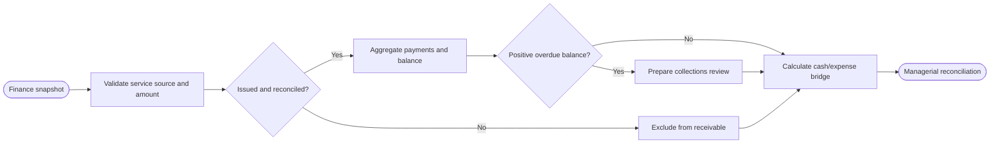

# SOP — Cobranza y reconciliación gerencial

## Procedure

1. Confirm each invoice references exactly one completed work/tow source and matches its authorized amount.
2. Include only `issued` invoices in invoiced/receivable.
3. Aggregate payments by invoice; enforce unique reference and payment ≤ amount.
4. Balance = issued invoice − payments. Overdue requires positive balance and due date before fixed cutoff.
5. Cash net = cash-method payments − cash-method expenses. Keep quotes, expenses, non-cash payments and receivables separate.
6. Produce a reminder/reconciliation draft only; never send, charge, refund or write off.

## Exceptions

- Draft/void invoice: excluded from receivable.
- Mismatched customer/source/amount, overpayment or duplicate payment reference: fail closed.
- Overdue balance: collections review with invoice evidence.
- Negative cash net is an observation, not negative receivable or insolvency.

## RACI

| Activity | Finance/admin | Service owner | Analyst | Customer |
|---|---:|---:|---:|---:|
| Invoice/source reconciliation | A/R | C | R | I |
| Payment evidence | A/R | I | C | C |
| Aging/cash bridge | C | I | A/R | I |
| Contact/payment action | A/R | I | I | C |

## Acceptance

`AT-COL-01` non-issued excluded; `AT-COL-02` overpayment/duplicates reject; `AT-COL-03` overdue produces pending draft without external action.
