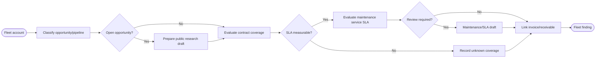

# SOP — Flotillas: venta, contrato y servicio

## Procedure

1. Treat opportunity state/value as commercial pipeline only.
2. A research draft may summarize authorized public facts; it neither contacts nor predicts purchase.
3. Evaluate contract status, effective dates and approval reference against service `opened_at`.
4. Exclude cancelled work; mark insufficient contract evidence `unknown`; never put unknown in measured SLA denominator.
5. Evaluate maintenance due/date/mileage and eligible service status/downtime.
6. Link issued invoices/payments for a separate receivable view.

## Exceptions

- Missing/invalid contract evidence: unknown SLA coverage.
- Open eligible service at risk/breached: human review draft.
- Maintenance due without reliable odometer/timing source: review, not scheduling.
- Open opportunity: research draft with no outreach, price or SLA commitment.

## RACI

| Activity | Fleet sales | Account/service owner | Finance | Analyst |
|---|---:|---:|---:|---:|
| Opportunity/research | A/R | C | I | R |
| Contract/SLA interpretation | C | A/R | I | R |
| Maintenance/service review | I | A/R | I | R |
| Receivable review | I | C | A/R | R |

## Acceptance

`AT-FLEET-01` research never sends; `AT-FLEET-02` insufficient coverage stays unknown; `AT-FLEET-03` eligible risk produces grounded human review.
