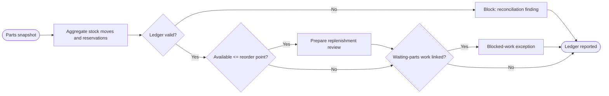

# SOP — Partes, compras y disponibilidad

## Procedure

1. Resolve catalog→supplier and purchase/movement/reservation references.
2. Calculate on-hand from the movement journal. An `ordered` purchase contributes zero until a `receive` movement exists.
3. Calculate reserved from active reservations and available = on-hand − reserved.
4. Reconcile returns against consumed quantity at the same part/work/cost basis.
5. Compare available with `reorder_point`; create a review draft only.
6. Join reservations/work orders to expose `waiting_parts` evidence without claiming that buying a part resolves the delay.

## Exceptions

- Negative on-hand/available, receipt over purchase, or cost-bucket mismatch: fail closed.
- Part at/below reorder: review, not purchase.
- Waiting work with no grounded part/reservation link: report coverage unknown.
- Adjustment requires a reason; the report does not apply adjustments.

## RACI

| Activity | Parts owner | Workshop controller | Analyst | Supplier |
|---|---:|---:|---:|---:|
| Physical/source reconciliation | A/R | C | C | I |
| WIP link | C | A/R | R | I |
| Metric and exception | C | C | A/R | I |
| Purchase decision/contact | A/R | C | I | C |

## Acceptance

`AT-PART-01` ordered stock excluded; `AT-PART-02` negative/over-reserved inventory rejected; `AT-PART-03` reorder and waiting-work reviews remain grounded and non-executing.
