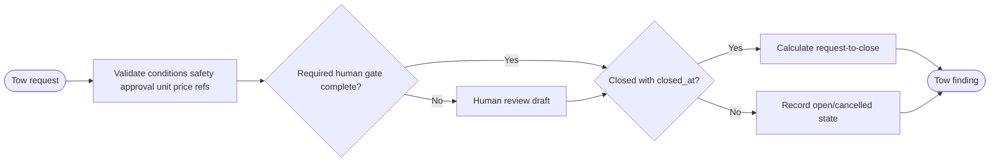

# SOP — Grúas: hitos y gates humanos

## Procedure

1. Read current request status, locations, conditions and milestone timestamps.
2. Check presence of `safety_ref`, `human_approval_ref`, `unit_id` and `amount_cents` where the state requires them.
3. Missing evidence creates a review proposal. Presence proves only that a field was recorded; it does not certify scene safety, equipment, driver, legality or approval identity.
4. For closed cases with timestamps, calculate request→close only. Do not call it response, arrival or service time.
5. Report open/cancelled states and scope limitations. No adapter assigns, messages or dispatches.

## Exceptions

- Advanced/open state without complete human gate: high-priority review.
- Closed without `closed_at`, future/negative timestamps or inconsistent refs: dataset validation failure.
- Unknown conditions/capability: human review, never inferred safe.

## RACI

| Activity | Coordinator | Human safety/dispatch approver | Analyst | Requester |
|---|---:|---:|---:|---:|
| Capture/source evidence | R | A | C | C |
| Safety/unit/price/dispatch decision | C | A/R | I | C |
| Completeness/duration report | C | I | A/R | I |

## Acceptance

`AT-TOW-01` missing refs produce review without dispatch; `AT-TOW-02` duration label is exact; `AT-TOW-03` complete refs are not described as safety certification.
