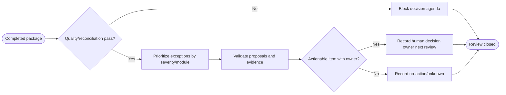

# SOP — Revisión semanal de decisiones

## Procedure

1. Open the exact package/receipt; stop if quality or reconciliation failed.
2. Review blocked/integrity items before business metrics.
3. Sort exceptions by severity and module; retain entity/field/version evidence.
4. Validate every proposal as pending, approval-required, non-executing and grounded.
5. A human accepts/rejects/defers outside the pipeline and names owner/date/evidence needed.
6. Record unknown/no-action explicitly. Do not mutate the source or claim recommendation impact.

## Suggested agenda

1. Data quality and blocked claims.
2. Tow human gates and money integrity.
3. WIP/parts, maintenance/SLA and overdue receivables.
4. Follow-up, research and marketing drafts.
5. Owners, decisions, next evidence and next review.

## RACI

| Activity | Manager | Functional owner | Analyst | Deterministic agent |
|---|---:|---:|---:|---:|
| Quality gate | I | C | A/R | I |
| Evidence/exceptions | C | R | A/R | C |
| Decision/priority | A/R | R | C | I |
| External action | A | R | I | I |

## Acceptance

`AT-WEEK-01` failed quality blocks agenda; `AT-WEEK-02` valid items retain evidence/owner/approval boundary; `AT-WEEK-03` human decision does not mutate snapshot or external systems.
