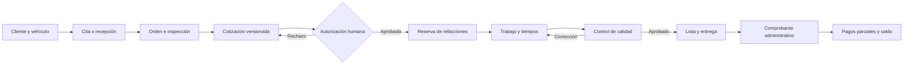
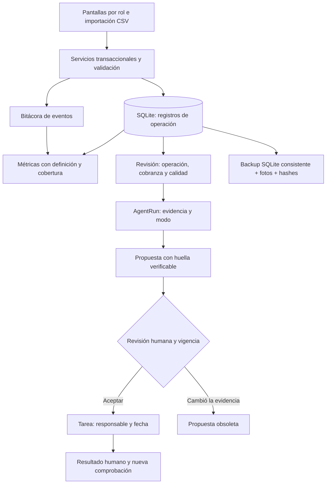

# Procesos, fuentes y decisiones · V5

## Operación diaria

| Proceso | Responsable | Entrada y fuente | Salida, control y excepción |
| --- | --- | --- | --- |
| Recepción a autorización | Recepción | Customer, Vehicle, Appointment, WorkOrder, Inspection | Quote/QuoteLine con versión; nombre y referencia de quien autoriza. No trabajo sin aprobación. Cliente/VIN del vehículo quedan protegidos tras existir historial. |
| Abastecimiento a consumo | Refacciones | Supplier, Part, PurchaseOrder/PurchaseLine | Confirmar compra; recibir parcial con referencia única; StockMovement y Reservation conservan disponible, consumo, liberación y devolución. No stock negativo ni recepción duplicada. |
| Ejecución a entrega | Técnico asignado y recepción | WorkOrder, TimeEntry, QualityCheck | Etapas permitidas; controles con evidencia; última calidad aprobada en etapa actual antes de entregar. Técnico no accede a órdenes ajenas. |
| Entrega a saldo | Administración | Quote autorizada, Invoice, Payment | Comprobante no fiscal sólo tras entrega; pago parcial con clave de reintento; saldo reproducible, sin sobrepago. |
| Flotilla y mantenimiento | Recepción/gerencia | FleetContract, Vehicle, MaintenancePlan | Contrato y vencimiento; próxima fecha/km; completar plan exige orden entregada del mismo vehículo. Falta de odómetro queda como cobertura insuficiente. |
| Solicitud de grúa a cierre | Recepción y operador declarado | TowService | Hitos con hora y referencia humana; operador antes de salida; no despacho automático ni evaluación automática de seguridad. |

## Arquitectura de información

La aplicación adopta el patrón fuentes → definiciones → controles → decisiones → comprobación. Los datos transaccionales son la fuente del cálculo; el CSV es una exportación. Una tarea cerrada significa que alguien declaró un resultado y se revaluó la regla, no que el software haya demostrado un efecto causal en el negocio.

## Rutina recomendada para el piloto

Al abrir: recepción verifica citas, autorizaciones pendientes y fechas prometidas; técnicos revisan sus órdenes; refacciones concilia faltantes. Durante el día: cada trabajo, recepción de piezas, control y cobro se registra al ocurrir. Al cierre: gerencia revisa saldos, órdenes detenidas y cobertura; ejecuta las tres revisiones, acepta sólo propuestas vigentes y asigna acciones. Se guarda un respaldo y se revisa que el proceso terminó correctamente.

Cada semana: reconciliar una muestra de órdenes contra autorizaciones y cobros, revisar costos faltantes y tiempos ausentes, comprobar vencimientos de contratos/mantenimiento y restaurar un respaldo en un directorio aislado. Este calendario es un procedimiento humano recomendado; no se ha activado un programador ni se ejecutan tareas externas en segundo plano.

## Puesta en servicio con cliente

1. Acordar responsables, catálogo, moneda, zona horaria y criterio de entrega.
2. Crear cuentas personales y cargar CSV de catálogos con previsualización. Registrar saldos/órdenes mediante flujos operativos; no importar movimientos financieros sin conciliación.
3. Ensayar una orden con el equipo y restaurar su copia de prueba.
4. Registrar aceptación, defectos y soporte. Comparar métricas sólo después de comprobar cobertura del periodo.

El software tiene evidencia automatizada y visual sobre datos ficticios. La capacitación, la calidad de datos reales, la infraestructura de red y el resultado económico requieren validación con el cliente.
