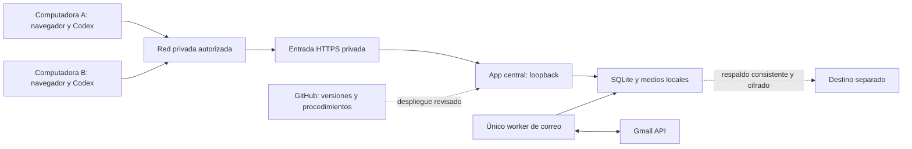

# Infraestructura de Milenio · dos computadoras, una operación

Estado: **arquitectura definida; despliegue compartido pendiente**. Inicio: 6 octubre 2026. Entrada para personas y Codex: este archivo. La solicitud autoriza preparar y publicar la definición; no se abrieron puertos ni conectó Gmail durante esta entrega.

## Decisión

Un equipo Windows central ejecuta Django/Waitress, SQLite y un único worker de correo. Dos computadoras acceden por navegador, cada una con su usuario. Codex actúa sobre la misma instalación; el historial y las decisiones operativas se guardan allí. El central puede ser también una de las dos computadoras de trabajo.

Mantener SQLite en el disco del servidor es suficiente como arquitectura inicial para dos clientes web y este piloto; verificar carga antes de ampliar. Ningún cliente abre el archivo SQLite por SMB/OneDrive/Drive. Si se requieren múltiples servidores de aplicación, reevaluar PostgreSQL y coordinación distribuida; no copiar bases activas entre equipos.

## Qué se comparte y qué no

| Elemento | Ubicación y regla |
|---|---|
| Empresas, contactos, correo, estados y tareas | Base central; ambas computadoras consultan el mismo registro. |
| Código y procedimientos | GitHub; versiones identificadas por SHA. Una actualización en servidor beneficia a ambos navegadores. |
| Credenciales Gmail | Almacén privado del servidor. DPAPI actual está ligado al usuario Windows; conservar identidad de ejecución. |
| Certificados y claves de red | Almacén privado por equipo; permisos mínimos; nunca Git. |
| Configuración del equipo | `private/infra.local.json`, excluido de Git. Plantillas públicas en esta carpeta. |
| Chats de Codex | Ayuda conversacional; no son un libro mayor ni sincronizan sesiones entre PCs. |
| Respaldos | Copias consistentes, cifradas, fuera del disco principal; sin worker activo en restauraciones de ensayo. |

## Componentes y responsabilidades

| Componente | Estado | Responsabilidad |
|---|---|---|
| App y lanzador local Windows | Existe en main | Acceso local, roles, operación y worker de analytics. |
| CRM comercial y Gmail | Implementado en workspace original; pendiente de integrar como versión remota reproducible | Cola, respuestas, límites, bajas y conciliación. No confundir con main. |
| Guías + `infra_doctor.py` | Incluidos en esta entrega | Orientación portable para Codex y diagnóstico sin modificar datos. |
| VPN + HTTPS privado | Por desplegar | Acceso desde equipos autorizados y protección de sesiones. |
| Ejecución al arrancar Windows | Por implementar/probar | Supervisor, reintento con espera, identidad de servicio y registros. |
| API de acciones para Codex | Contrato definido; por implementar | Consultar/actualizar CRM y preparar mensajes conservando reglas y auditoría. |
| Bloqueo de conversación y mantenimiento | Por implementar | Evitar respuestas simultáneas y despliegues en paralelo. |
| Prueba integral de dos equipos + Gmail | Pendiente | Verificar circuito real antes de campaña. |

Consultar [estado verificable](estado.json), [operación desde Codex](OPERACION-CODEX.md), [red y seguridad](RED-Y-SEGURIDAD.md), [actualización y recuperación](DESPLIEGUE-Y-RECUPERACION.md), [contrato de agentes](CONTRATO-AGENTE.md) y [aceptación](ACEPTACION.md).

## Red y disponibilidad elegidas

Entrada del CRM por HTTPS en la interfaz privada, con firewall limitado a los dos equipos. Waitress sigue en loopback; la base no se expone. Para equipos remotos, evaluar WireGuard tras comprobar router, NAT/CGNAT y acceso administrativo. Si no hay ruta entrante utilizable, elegir un relay o alojamiento; no prometer conectividad gratuita antes de verificarla. La VPN no se instala ni selecciona silenciosamente en este documento.

El software propuesto puede ser libre; equipo, electricidad, internet y un eventual relay/alojamiento tienen costo. No se presupone que un plan gratuito de uso personal admita uso empresarial.

El inventario y el diagnóstico orientan a Codex; no constituyen todavía un control de ejecución. El lanzador heredado no lee `infra.local.json`. Antes del despliegue compartido debe incorporar una validación obligatoria que rechace el arranque live/worker en clientes o equipos sin asignar. Hasta entonces, no usar ese lanzador en una computadora cliente.

Objetivo inicial: operación durante la jornada del taller. No es SLA 24/7. Si se apaga/suspende el central o pierde internet, Gmail conserva correo recibido, el CRM remoto deja de estar disponible y la automatización se retrasa. El servicio vuelve a sincronizar antes de enviar; no elimina topes para compensar retrasos. El escritorio puede estar bloqueado; la identidad de servicio y las credenciales deben funcionar sin sesión interactiva antes de afirmar arranque autónomo.

Codex no reemplaza el worker: sus tareas dependen de ejecución disponible, permisos y límites de cuenta. Programar revisiones de Codex es independiente de activar correo continuo; ningún heartbeat se crea por tener este documento.

## Primer uso desde otra computadora

1. Clonar este repositorio y abrirlo en Codex. Leer `AGENTS.md`; no ejecutar el lanzador live por defecto.
2. Obtener de Gerencia la URL privada del central y acceso individual, una vez desplegados. Copiar la plantilla cliente a `private/infra.local.json` y completar localmente.
3. Pedir a Codex: «Lee AGENTS.md y revisa Milenio en modo cliente. Diagnostica sin iniciar otra instancia ni enviar mensajes».
4. Abrir la URL central. Para mantenimiento de código, crear una rama y PR; la instalación central se actualiza mediante el procedimiento, no por cada clon.

## Información aún necesaria para desplegar

Elegir equipo central y responsable; saber si las PCs están en la misma red; comprobar Windows, energía, internet y NAT; definir usuarios, hostname/URL privada y destino de respaldo; confirmar ventanas de mantenimiento. Esos datos se guardan en inventario privado, no en el repo público. Ninguno se ha inventado.

## Referencias técnicas

- [Django: despliegue y protección HTTPS](https://docs.djangoproject.com/en/5.2/howto/deployment/checklist/).
- [SQLite: mantener acceso al archivo en el servidor](https://www.sqlite.org/useovernet.html).
- [WireGuard: configuración de pares y rutas](https://www.wireguard.com/quickstart/).

Estas referencias sustentan la arquitectura; no acreditan una instalación realizada en Milenio.
