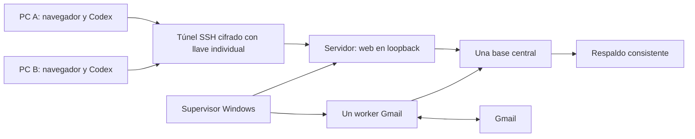

# Milenio: instalar un servidor y conectar dos computadoras

**Paquete de despliegue implementado. La instalación en los equipos elegidos y la conexión real de Gmail se verifican allí.** Código del taller, CRM, correo, captura y herramientas de despliegue incluidos; ninguna base real ni credencial se distribuye.

## Arranque desde una descarga

En la computadora elegida, descomprimir el ZIP o clonar esta versión. Abrir la carpeta en Codex y pedir:

> Lee AGENTS.md e infra/INSTALAR.md. Prepara esta computadora como servidor Milenio con Setup-Server.ps1. Conserva datos existentes, verifica instalación y acceso, y registra resultados privados. No envíes correos ni inventes credenciales. Completa todas las acciones independientes antes de solicitar una autorización interactiva necesaria.

El agente sigue [INSTALAR.md](INSTALAR.md). `Setup-Server.ps1` prepara Python/dependencias, copia una release identificada por hash a una carpeta local fuera de OneDrive, protege permisos, crea identidad única, aplica migraciones y arranca el supervisor. La instalación nueva tiene base vacía y correo desactivado. Repetirla no borra datos ni cambia la identidad.

## Qué queda instalado y qué depende del equipo

| Función | Implementación incluida | Validación en destino |
|---|---|---|
| Taller + CRM + correo + captura | Código y migraciones | Crear Gerencia, importar datos privados si corresponde |
| Instalar/actualizar | Setup-Server, releases por hash, copia previa a migración | Dependencias y permisos de Windows |
| Proceso continuo | Supervisor, reinicio con espera, exclusión mutua | Reinicio de Windows y cuenta de ejecución |
| Arranque y backup diario | Registro de tareas; backup 03:00 con parada breve | Contraseña Windows o modalidad al iniciar sesión; destino externo |
| Acceso de otra PC | OpenSSH separado, llaves, firewall limitado, túnel local | IP/ruta entre equipos, llave pública verificada |
| Codex | API autenticada y CLI; lectura/preparación/envío por permisos | Credencial individual emitida por Gerencia |
| Concurrencia | Versiones, reserva 15 min, idempotencia de solicitudes | Ensayo con dos agentes/usuarios |
| Gmail | OAuth DPAPI, worker separado, topes, respuestas acotadas | Consentimiento Google y prueba con buzón controlado |

GitHub contiene instrucciones y código. Los datos, mensajes, tokens y configuración son privados del servidor. Un clon no sincroniza datos ni se convierte en servidor. Clientes usan la URL del túnel local hacia **la misma base**. El túnel cifra el tráfico entre computadoras; HTTP solo circula dentro de loopback en cada extremo. No se configura proxy TLS ni se expone Waitress directamente.

Este transporte requiere que el cliente pueda llegar al servidor por una red privada. En redes distintas sin ruta entre ellas, Codex debe resolver VPN o conectividad con el responsable; el instalador no abre un router ni evade CGNAT. El software es gratuito; electricidad, hardware, internet y eventual alojamiento siguen siendo recursos externos.

## Continuidad

[Operación con Codex](OPERACION-CODEX.md) · [API](CONTRATO-AGENTE.md) · [Seguridad](RED-Y-SEGURIDAD.md) · [Mantenimiento y recuperación](DESPLIEGUE-Y-RECUPERACION.md) · [Aceptación](ACEPTACION.md) · [Estado](estado.json).

Apagar/suspender el servidor detiene CRM y automatización; Gmail sigue recibiendo. Codex puede revisar y mantener, pero el transporte de correo lo ejecuta el worker. La disponibilidad 24/7 requiere energía, red y un servidor activo.
