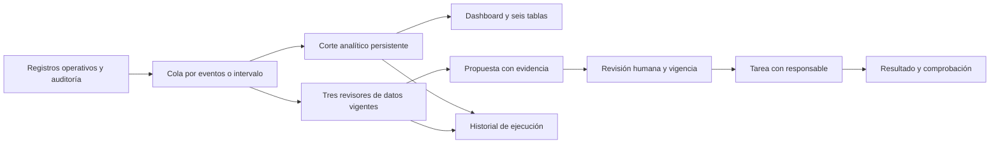

# Contrato V6: operación, analytics y agentes

Alcance: instancia local de un taller. Amplía los contratos V5 sin cambiar la autoridad de las personas sobre órdenes, inventario, dinero o comunicaciones.

## Interfaces y persistencia

| Productor | Salida | Consumidor |
| --- | --- | --- |
| `analytics.refresh_analytics` | `AnalyticsSnapshot` y `AnalyticsRow` en una transacción | Constructor del dashboard y explorador |
| `analytics.build_analytics_dashboard` | Filtros, comparación, KPIs, tendencias, rankings y cobertura del corte | `/analytics/` y exportación JSON |
| Auditoría de negocio e intervalo | `AutomationJob` con clave única y cursor observado | `automation.run_once` |
| Trabajador | Corte, identificadores de `AgentRun`, intentos, error y contexto de evidencia | `/automations/` |
| `intelligence.run_agents` | Hallazgos y propuestas con referencias verificables | Revisión y tareas V5 |

Las seis tablas derivadas son `daily_operations`, `service_lines`, `part_usage`, `receivables`, `order_journeys` e `inventory`. Su grano y semántica temporal se definen en [Analytics V6](../docs/V6-ANALYTICS.md). Un corte guarda filas, huella de fuentes, fecha de lectura y cursor; una consulta histórica no vuelve a calcular sus filas desde datos actuales. Los enlaces a fuentes muestran el registro operativo vigente.

## Invariantes

- GET no crea cortes ni trabajos. Configurar o encolar requiere POST, sesión, permiso de servidor y CSRF.
- Dashboard e historial requieren `intelligence_read`; tablas y exportaciones requieren `data_read`; configuración requiere `manage`; encolar requiere `review`.
- Compras y reservas no son consumo. Las devoluciones restan consumo; las unidades no se suman entre artículos incompatibles.
- Autorización de una cotización, vínculo a factura y ejecución del servicio son hechos diferentes. El valor cotizado vinculado a facturas no es una distribución contable por servicio.
- Facturación y cobro usan sus respectivas fechas. WIP y saldo son estados al corte. Tiempos sin auditoría suficiente conservan cobertura faltante.
- Reglas es el modo predeterminado. El modo nativo exige habilitación local y selección explícita; no existe alternativa por API de pago.
- La pausa impide reclamar trabajos pendientes. Reglas tiene un máximo de tres intentos; inferencia nativa tiene uno y no se repite automáticamente ante un resultado ambiguo.
- La concesión del trabajador se renueva y su propietario condiciona la escritura final. El servidor supervisa al proceso hijo mediante stdin y cierre acotado.
- Un corte se guarda antes de la lectura de los revisores. Los cursores muestran actividad auditada entre ambas etapas; no garantizan una única lectura congelada ni detectan cambios sin auditoría.
- Una salida nativa inválida no crea propuestas. Si hubo un turno completado, se conserva su recibo aunque la validación posterior falle. La aceptación de propuestas vuelve a comprobar la evidencia.
- El servidor inicia una demo ficticia sólo en modo demo vacío; live permanece vacío. La semilla no deja credenciales predeterminadas utilizables.

## Verificación

`test_analytics`, `test_analytics_web`, `test_automation`, `test_analytics_demo` y `test_intelligence` ejercen estos contratos con datos desechables. `verify_v6_delivery.py --package` comprueba además actualización, respaldo/restauración, hashes e instalación offline con servidor extraído. Los recibos de ejecución nativa y navegador se conservan por separado. Ver [límites y evidencia de entrega](../docs/V6-VERIFICACION.md).
